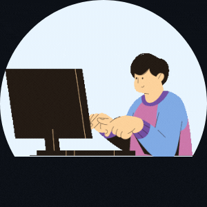

 
# Olá, Eu sou o **Leandro Cesar Lobato**
 
📚 Atualmente estudando JavaScript, Frontend, UI/UX design. 
 

 

 

 
 
  
   <!---->
  
  
  <!--
  -->
  

 
 
 
    
    
    
   
    
 

 

<!---
LeCeLo/LeCeLo is a ✨ special ✨ repository because its `README.md` (this file) appears on your GitHub profile.
You can click the Preview link to take a look at your changes.
--->
